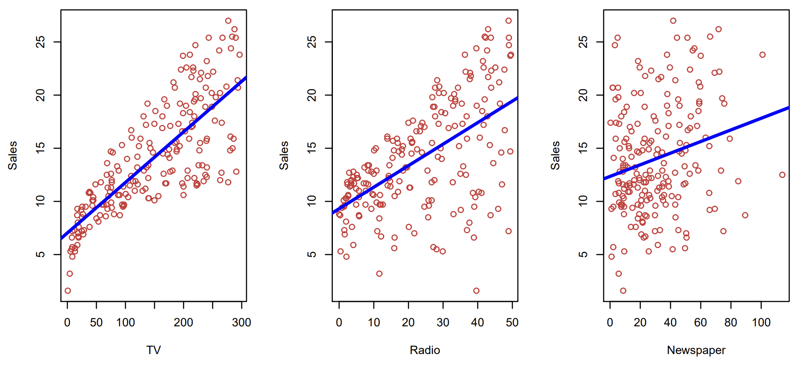
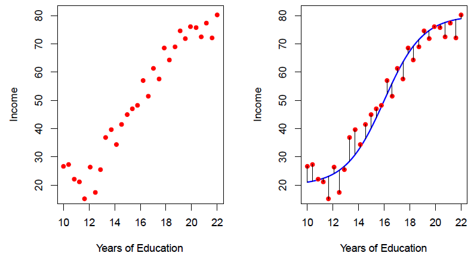
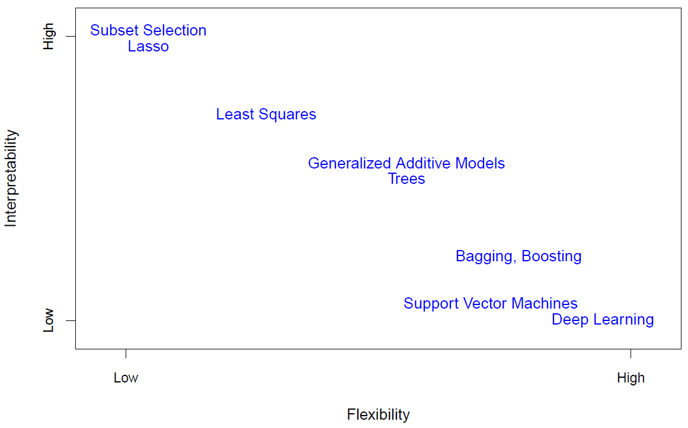
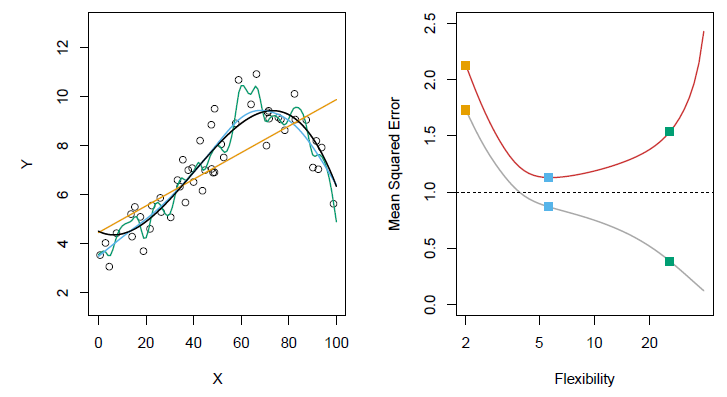
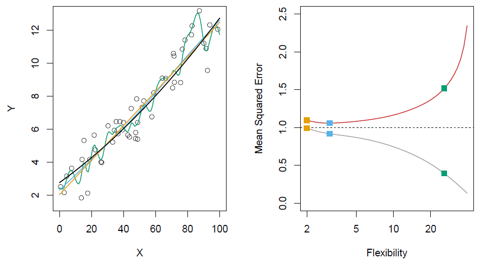
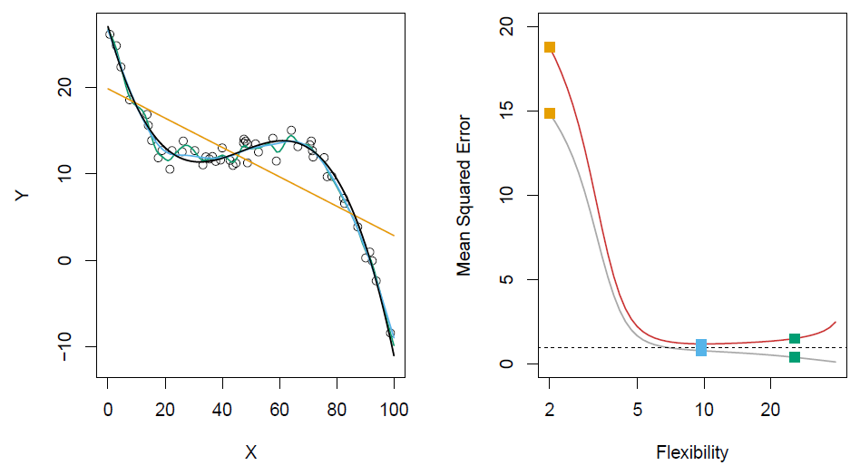
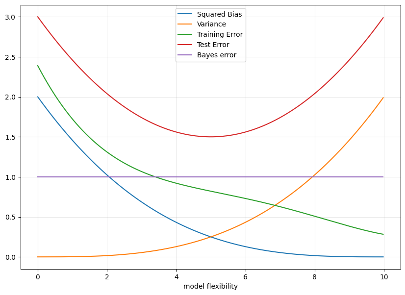

# Bias-Variance Tradeoff

## Introdução

O principal objetivo de um modelo de aprendizado de máquina (*machine learning*) supervisionado é de aprender com um conjunto de dados e rótulos (também conhecidos como *features* e *target*) como generalizar características dessas informações em dados ainda não vistos.

E acompanhando esse objetivo principal, vem o de medir de maneira objetiva o quão bem esse nosso modelo de aprendizado generalizou essas características nos dados que foram apresentados pra ele. Dito isso, analisamos características como: qualidade do ajuste, erro da predição e viés. Essa se faz uma etapa necessária para entender o quão útil esse modelo será em nos ajudar nas duas tarefas principais que um modelo pode ter: *predição* ou *inferência*.

> “Todos os modelos estão errados, mas alguns são úteis” - *George Box.*

Chamamos a capacidade de generalização do modelo em um dado conjunto de dados de “ajuste" (*fit*). Associado ao ajuste, vamos ter o erro individual calculado para cada um dos pontos, e diversas outras medidas e formas de calcular a qualidade desse ajuste. A figura 1 mostra um exemplo de um ajuste linear no conjunto de dados de anúncios.

*Figura 1 - Conjunto de dados de anúncios. Da esquerda pra direita, temos as relações entre investimentos em TV x Vendas, investimentos em Rádio x Vendas e investimentos em Jornais x Vendas*.

Como podemos ver, apesar do ajuste linear apresentar um bom ajuste “visual” nas relações de vendas com TV e Rádio, vemos que ele apresenta um ajuste pior na relação entre vendas e investimentos em Jornais.

O ajuste linear é um dos mais simples e menos complexos que podemos assumir entre dois conjuntos de dados. A verdade é que, podemos aumentar a complexidade dos modelos que utilizamos para obter um ajuste melhor aos dados. A Figura 2 exemplifica isso melhor ao mostrar um ajuste não linear na relação entre renda e anos de educação, apesar de uma relação linear também poder ser obtida, porém com um erro maior.

*Figura 2 - Conjunto de dados de renda. Na figura à esquerda, os dados que relacionam Renda x Anos de Educação, na figura a esquerda, o polinômio não linear utilizado para gerar esses dados (adicionando erros randomicamente).*

Também, na imagem à direita da Figura 2 podemos perceber certas linhas em preto ligando os pontos até seu ajuste modelado. A distância de cada ponto vermelho até o ajuste em azul é chamado de erro do modelo.

## Modelos paramétricos *x* não paramétricos

O que percebemos nos exemplos retratados nas Figuras 1 e 2 é que os modelos utilizados faziam alguma suposição inicial sobre o formato dos nossos dados. Isso é uma característica de modelos chamados *paramétricos*. Uma forma que eu gosto de pensar sobre é que, justamente pela questão de existir uma suposição sobre esse formato, o modelo apresenta um caráter enviesado (*bias/biased*) sobre os dados que está observando.

> 💡 Viés (ou tendência): “tendência geral ou determinada por forças externas.” - *Oxford Languages*.

Além deles, existem também os modelos chamados *não paramétricos*. Esses, em questão, não fazem suposições acerca da forma dos dados e tentam encontrar o melhor ajuste possível para cada um dos conjuntos apresentados, evitando assim modelos que não descrevam bem o comportamento por assumir uma forma prematura. Esses tipos de modelos apresentam uma grande vantagem em relação aos paramétricos por conseguirem se adequar a um espaço maior de possibilidades de ajuste em diversos tipos de dados, introduzindo menos viés no cálculo de erro total do modelo.

Geralmente, modelos não paramétricos costumam ser mais flexíveis e complexos que modelos paramétricos, em troca de precisarem de mais dados. Um parâmetro também comum ao se abordar modelos não paramétricos mais complexos é a questão da interpretabilidade.

> 💡 Interpretabilidade: descreve a possibilidade de compreender o modelo de aprendizado de máquina e de apresentar base para a tomada de decisão de uma maneira mais compreensível para humanos. - *Explainable Artificial Intelligence (XAI): Concepts, Taxonomies, Opportunities and Challenges toward Responsible AI, Alejandro Barredo Arrieta, et al.*

A verdade é que, na maioria das vezes, quanto mais simples for o modelo, maior é sua interpretabilidade. Pegue como exemplo, o ajuste linear feito na Figura 1 e perceba o quão mais simples é perceber e entender as relações feitas por esse ajuste. Modelos mais complexos perdem características de interpretabilidade, por performar diversas condições internas que não são facilmente entendíveis para nós, humanos.  A Figura 3 mostra a relação de interpretabilidade x flexibilidade de alguns modelos existentes dentro do ecossistema de aprendizado de máquina.

*Figura 3 - Relação interpretability x flexibility para alguns modelos conhecidos dentro do ecossistema de aprendizado de máquina (machine learning).*

Abordaremos ao longo desse artigo como a diferença entre esses tipos de modelos atua quando estamos avaliando da ótica da performance de modelo. Para seguir de agora em diante, utilizaremos um modelo de regressão para exemplificar as maneiras de medir a qualidade desse ajuste. Apesar de fugir ao escopo desse artigo, o próximo parágrafo faz uma pequena recapitulação do que é um modelo de regressão e da métrica que estaremos utilizando para medir a qualidade do ajuste.

Modelos de regressão são modelos que tem como objetivo definir uma variável quantitativa como resposta (*target*). Uma aplicação comum disso pode ser definir qual o salário médio de uma pessoa baseado nos anos de estudo dela (como visto na Figura 2), ou o preço estimado de uma casa baseado em suas características (área do lote, número de quartos, proximidade de escolas, hospitais, etc). A medida mais comum no cenário de regressão para endereçar a qualidade do ajuste é o Erro Médio Quadrático (*Mean-Squared Error*, ou *MSE*), onde temos a soma do quadrado de todas as distâncias entre o ponto predito e o verdadeiro (pense linha preta que liga a bolinha vermelha na linha azul na Figura 2), dividido pelo número de amostras onde esse valor foi calculado (pros fãs do “matematiquês”, deixei a equação que representa o MSE abaixo).

$$
MSE = \frac{1}{2}\sum_{i=1}^{n}(y_i - \hat{f}(x_i))^{2}
$$

## Qualidade do ajuste e conjuntos de treino e teste

Quando queremos ensinar um comportamento para um modelo de aprendizado de máquina, é comum querermos testar o quão bom o nosso modelo foi em dados novos, mas não só isso, dados novos que tenham rótulos (*targets*) que nos permitam também calcular a performance dele.

Para isso, uma estratégia comum é separar os dados em dois principais conjuntos, chamados de *treino* e *teste.* O modelo é exposto aos dados de *treino* para aprender relações entre os dados e realizar o seu ajuste. Após essa exposição, o modelo faz suas predições dos dados de *teste*. É comum que o maior interesse seja em calcular as métricas de qualidade de ajuste no conjunto de *teste*, que vai ditar o comportamento do modelo em dados que não foram vistos previamente, mas isso não nos impede de tirar informações importantes sobre a qualidade do nosso modelo também aplicando essas métricas no conjunto de *treino*.

Aqui, novamente, discutimos sobre o quão flexível um modelo é, e o quanto isso influencia nas medidas de qualidade de ajuste nos conjuntos de *treino* e de *teste*. Na Figura 4 à esquerda, podemos ver um conjunto de dados gerados a partir da linha em preto com algum erro randômico adicionado, seguido de 3 modelos tentando realizar esse ajuste. Já a figura a direita mostra o MSE de *treino* (em cinza) e de *teste* (em vermelho), com os pontos amarelo, azul e verde representando os modelos da figura a esquerda.

*Figura 4 - Na esquerda, a função que gerou os pontos (em preto), seguido de 3 modelos ajustados: o amarelo (regressão linear), o azul (polinômio) e o verde (algum modelo mais complexo de grau maior). Na direita, o MSE referente ao treino (em cinza) e ao teste (em vermelho) para cada um deles.*

O que nós vemos é que no *trade-off* entre flexibilidade do modelo e sua qualidade de ajuste, o modelo intermediário conseguiu o melhor resultado no teste, apesar do verde ter conseguido o melhor resultado no treino. A questão é: enquanto o modelo verde (mais flexível) foi capaz de aprender todas as características dos dados de *treino* apresentados pra ele, ele não conseguiu generalizar bem em dados de *teste*. Chamamos essa característica onde o modelo aprende “muito bem” os dados de *treino* e não consegue generalizar os dados de teste de *overfitting* (ou, no português, sobreajuste).

Podemos reparar também que o ajuste do modelo amarelo (menos flexível), gerou um valor de qualidade do ajuste alto tanto pra treino, quanto pra teste, mostrando que o modelo não foi capaz de se ajustar bem aos dados de *treino*, nem generalizar nos dados de *teste.* Para esses modelos onde tanto a métrica de qualidade do ajuste é alta para o *treino* e para o *teste*, e o modelo é incapaz de generalizar qualquer coisa, damos o nome de *underfitting* (ou, no português ajuste insuficiente). Discutiremos esses dois termos com mais calma logo a frente.

A Figura 5 mostra um outro exemplo semelhante a figura 4 onde podemos ver que a distância dos valores de qualidade dos ajustes de *treino* e *teste* se distanciam cada vez mais conforme a flexibilidade do modelo vai aumentando.

*Figura 5 - Na esquerda, a função que gerou os pontos (em preto), seguido de 3 modelos ajustados: o amarelo (regressão linear), o azul (polinômio) e o verde (algum modelo mais complexo de grau maior). Na direita, o MSE referente ao *treino* (em cinza) e ao *teste* (em vermelho) para cada um deles.*

O exemplo da Figura 5 se faz necessário para mostrar um caso onde o modelo mais complexo ainda geraria um sobre ajuste, mas onde o modelo menos complexo não necessariamente gerou um sob ajuste. Já a Figura 6 mostra o oposto: um caso onde o modelo mais complexo e flexível teve uma boa performance, sendo muito superior ao modelo menos flexível. Para entender melhor porquê essas situações acontecem, precisamos investigar melhor como o erro desses modelos é calculado.

*Figura 6 - Na esquerda, a função que gerou os pontos (em preto), seguido de 3 modelos ajustados: o amarelo (regressão linear), o azul (polinômio) e o verde (algum modelo mais complexo de grau maior). Na direita, o MSE referente ao *treino* (em cinza) e ao *teste* (em vermelho) para cada um deles.*

## O cálculo do erro

Finalmente chegamos na seção onde discutiremos mais amplamente como o erro do modelo é calculado, e entender suas componentes. Essencialmente, todo erro é composto por duas partes: uma parte referente ao modelo, e uma parte chamada de erro irredutível (ou *Bayes Error*). Esse erro irredutível, como o próprio nome diz, é o erro independe da qualidade do modelo, representando uma certa quantidade de ruído em nossos dados.

A outra seção, referente ao modelo, também é dividida em duas partes: a variância (*variance*) e o quadrado do viés (*squared bias*).

$$
Error = Variance + Bias^2 + Irreducible \ Error
$$

E, novamente, para os amantes do “matematiquês”:

$$
E_{MSE}(y_0 - \hat{f}(x_0))^2 = \mathrm{Var}(\hat{f}(x_0)) + [\mathrm{Bias}(\hat{f}(x_0)))]^2 + \mathrm{Var}(\epsilon)
$$

Já discutimos nesse artigo algumas noções de viés, normalmente gerado por fazer suposições sobre um formato específico dos dados quando na verdade ele não existe. A Figura 4 mostra isso bem comparando o modelo linear e o modelo polinomial. O viés do modelo linear contribuiu tanto para que seu erro de *treino* quanto de *teste* fossem maiores, enquanto o viés do modelo polinomial foi menor, apesar de ainda existir.

O que acontece na prática é que conforme você diminui o viés nos seus dados aumentando a flexibilidade do seu modelo, normalmente você está aumentando a variância dele. E agora é hora de entendermos um pouco melhor esse termo.

> 💡 Variância: “a *Variância* se refere a quantidade de mudanças que teríamos em nossa função de predição $\hat{f}$ se nós a estimássemos usando um conjunto de dados diferente.”

Olhando desse ponto de vista, se separássemos o nosso conjunto de *treino* em subconjuntos menores, porém significativos, e apresentássemos cada um desses conjuntos para nosso modelo, a variância seria a quantidade necessária de mudanças com o intuito de reajustar o nosso modelo. Pensando no caso de uma simples reta, seu formato não muda se apresentado a conjunto de dados diferentes, já no caso de um modelo não paramétrico, seus ajustes fariam sua forma mudar com mais facilidade se os subconjuntos tivessem diferenças expressivas entre si, aumentando a variância.

Fazendo uma pequena recapitulação de tudo que nós vimos até aqui:

- Sobre **erro**:
  - O erro é composto por, essencialmente, duas partes: uma que pode ser reduzida, e uma irredutível (constante).
  - Essa parte redutível é referente ao ajuste do modelo, e é composta pelo viés quadrático e sua variância.
  - Erros existem em ambos os conjuntos: *treino* e *teste*, e saber analisar a relação entre eles é necessário:
    - Erro de *treino* alto e erro de *teste* alto: o modelo realizou um ajuste insuficiente nos dados de *treino (underfitting).*
    - Erro de *treino* baixo e erro de *teste* alto: o modelo realizou um sobreajuste nos dados de *treino* e se tornou incapaz de generalizar nos dados de *teste (overfitting)*.
    - Erro de *treino* baixo e erro de *teste* baixo: o modelo foi capaz de se ajustar de maneira satisfatória nos dados de *treino* e generalizar bem nos dados de *teste*.
- Sobre **viés**:
  - O viés é adicionado ao assumir características sobre os dados que podem ou não ser verdade, normalmente sendo seu formato, meio que como a gente pensaria na palavra “viés” no uso normal do português: “ter um viés sobre algo”.
  - Modelos paramétricos fazem essas suposições sobre o formato dos dados, e portanto, possuem um viés mais alto em casos onde essa suposição pode não ser verdade. Já modelos não paramétricos não fazem essa suposição, e possuem viés menor.
  - Geralmente, o viés é alto quando a flexibilidade do modelo é baixa, e diminui conforme o modelo se torna mais flexível.
- Sobre **variância**:
  - A variância acontece conforme precisamos mudar nossa função de representação do modelo conforme apresentamos novos dados para ele.
  - Modelos paramétricos possuem um formato para a função de representação e tentam ajustá-la aos dados, possuindo baixa variância, já que a função não muda de formato ao ser apresentada a novos conjuntos de dados. Modelos não paramétricos, por não possuírem uma função de representação pré-definida, se ajustam aos dados e podem acabar se ajustando a ruído presente no conjunto, tendo assim uma variância maior.
  - Geralmente, a variância é baixa quando a flexibilidade do modelo é baixa, e aumenta conforme o modelo fica mais flexível.

Por fim, a Figura 7 condensa bem como cada um desses parâmetros se comporta em relação a flexibilidade do modelo (linhas desenhadas de maneira arbitrária pra representar o comportamento por alto).

*Figura 7 - *Erros (Bias², Variance, Train, Test, Bayes)* x *Flexibilidade.*

## Considerações finais

Medir a qualidade do ajuste de um modelo é algo de grande importância quando se está trabalhando com aprendizado de máquina. A verdade é que não existe um modelo perfeito “bala de prata” que pode resolver todos os nossos problemas. Saber analisar o que as medidas de ajuste falam pra nós é importante para nos dar a capacidade de discernir quando utilizar cada modelo, sabendo os *trade-offs* que cada técnica apresenta.

As vezes, é “ok” adicionar um pouco de viés e usar um modelo linear em uma situação que entender o que o modelo está fazendo é mais importante em si do que sua predição. E as vezes, a predição importa mais do que tudo e a gente não está olhando pra interpretabilidade do modelo, abrindo o leque para opções mais complexas.

> 💡 A verdade é que por mais maravilhosas que as *Redes Neurais* sejam, as vezes uma linha reta resolve o seu problema.

Existe um meme que eu gosto muito que eu vou compartilhar aqui com o objetivo de fechar esse artigo de maneira mais leve, mas que retrata muito a realidade da maioria dos casos quando estamos pensando em como abordar um problema, pensando se um ferramental é suficiente para tal tarefa:

---

Agradeço a todo mundo que leu até aqui! Desejo a todos um bom dia/tarde/noite e aceito comentários sobre o pequeno artigo!

Um abraço, **Gabriel**
