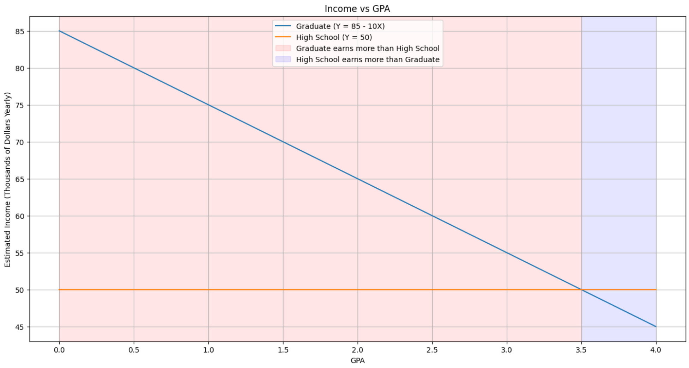

# Exercises - Chapter 3

## Exercise 1

Describe the null hypotheses to which the p-values given in Table 3.4 correspond. Explain what conclusions you can draw based on these p-values. Your explanation should be phrased in terms of `sales`, `TV`, `radio`, and `newspaper`, rather than in terms of the coefficients of the linear model.

**Answer**: The reference table (3.4 from the ISLP book):

||`Coefficient`|`Std. Error`|`t-statistic`|`p-value`|
|-|:-:|:-:|:-:|:-:|
|`Intercept`|2.939|0.3119|9.42|< 0.0001|
|`TV`|0.046|0.0014|32.81|< 0.0001|
|`radio`|0.189|0.0086|21.89|< 0.0001|
|`newspaper`|-0.001|0.0059|-0.18|0.8599|

Recalling what a p-value is: *"A p-value measures the probability of obtaining the observed results, assuming that the null hypothesis is true. The lower the p-value, the greater the statistical significance of the observed difference. A p-value of 0.05 or lower is generally considered statistically significant"*.

The null hypothesis for this case is: $H_{0}$: There is no relationship between X and Y. In this case, when the p-values are all less than 0.05, it means that we can reject the null hypothesis. On the other hand, the alternative hypothesis is: $H_{a}$: There is a relationship between X and Y. If $f$ can be approximated bby a linear function of the form $Y = \beta_{0} + \beta_{1}X_{1} + \epsilon$, then the hypothesis can be be rewritten as $H_{0}$: $\beta_{1} = 0$ and $H_{a}$: $\beta_{1} \neq 0$, where $\beta_{1}$ is the coefficient of the predictor variable $X_{1}$.

Analyzing the provided table, where we were given the p-values for the coefficients of the linear model, we can conclude that the `TV` and `radio` predictors are statistically significant, as their p-values are less than 0.05. This means that we can reject the null hypothesis that there is no relationship between the `TV` and `radio` predictors and the `sales` response. This means that **for every thousand units** increase in the `TV` and `radio` predictors, the `sales` response will increase by 46 and 189 units, respectively.

On the other hand, the `newspaper` predictor is not statistically significant, as its p-value is greater than 0.05. This means that we cannot reject the null hypothesis that there is no relationship between the `newspaper` predictor and the `sales` response. This means that the `newspaper` predictor does not have a significant impact on the `sales` response, and each unit increase in the `newspaper` predictor will not have a significant impact on the `sales` response.

## Exercise 2

Carefully explain the differences between the KNN classifier and KNN regression methods.

**Answer**: KNN is an acronym for K-nearest neighbors, one of the simplest and best-known non parametric methods. The chapter 3 discusses the general application of KNN on the context of regression, differing from the classification approach shown in chapter 2. Explaining the behavior of the algorithm on both cases, we have:

- KNN for regression: By the book, given a value for the parameter K (positive integer) and a prediction point $x_{0}$, the KNN regressor will identify the first K training observations that are closest to $x_{0}$, represented by $N_{0}$. Then, it estimates $f(x_{0})$ using the average of all the training responses in $N_{0}$. In other terms:

$$\hat{f}(x_{0}) = \frac{1}{K}\sum_{x_i \epsilon N_0}y_i$$

This can be better visualized on the figure below:

- KNN for classification: In chapter 2, where we discuss the application of KNN as a classifier, we have that given a positive integer K and a test observation $x_0$, the KNN classifier first identifies the K points in the training data that are closest to $x_{0}$, represented by $N_{0}$. Then, it estimates the conditional probability for class %j% as the fraction of points $N_0$ whose response values equal %j%. In other terms:

$$Pr(Y = j | X = x_0) = \frac{1}{K} \sum_{i \epsilon N_0} I(y_i = j)$$

And finally associating the test observation to the class with the largest probability from the equation above. This can also be better visualized on the figure below:

## Exercise 3

Suppose we have a data set with five predictors, $X_1$ = GPA, $X_2$ = IQ, $X_3$ = Level (1 for College and 0 for High School), $X_4$ = Interaction between GPA and IQ, and $X_5$ = Interaction between GPA and Level. The response is starting salary after graduation (in thousands of dollars). Suppose we use least squares to fit the model, and get $\hat{\beta}_0 = 50$, $\hat{\beta}_1 = 20$, $\hat{\beta}_2 = 0.07$, $\hat{\beta}_3 = 35$, $\hat{\beta}_4 = 0.01$, $\hat{\beta}_5 = −10$.

(a) Which answer is correct, and why?
    i. For a fixed value of IQ and GPA, high school graduates earn more, on average, than college graduates.
    ii. For a fixed value of IQ and GPA, college graduates earn more, on average, than high school graduates.
    iii. For a fixed value of IQ and GPA, high school graduates earn more, on average, than college graduates provided that the GPA is high enough.
    iv. For a fixed value of IQ and GPA, college graduates earn more, on average, than high school graduates provided that the GPA is high enough.

**Answer**: First, we need to separate our predictors and coefficients on the equation form $Y = \beta_1X_1 + \beta_0$ to then replace the values and understand the impact that each predictor has in our model:

$$Y = \beta_0 + \beta_1X_1 + \beta_2X_2 + \beta_3X_3 + \beta_4X_4 + \beta_5X_5$$

Which can be rewritten as:

$$Y = 50 + 20X_1 + 0.07X_2 + 35X_3 + 0.01X_4 + (-10)X_5$$

And for better readability on the predictors:

$$Y = 50 + 20(\mathrm{GPA}) + 0.07(\mathrm{IQ}) + 35(\mathrm{Level}) + 0.01(\mathrm{GPA}\times IQ) + (-10)(\mathrm{GPA}\times\mathrm{Level})$$

Considering a fixed value for IQ and GPA, their interaction will be fixed as well, and that $\beta_0$ is constant and will not affect the equation, we have:

$$Y = \beta_0 + \beta_3X_3 + \beta_5X_5 = 35X_3 + (-10)X_5 = 50 + 35(\mathrm{Level}) + (-10)(\mathrm{GPA}\times\mathrm{Level})$$

This leaves us with the following two possibilities:

- The level is college graduate: $Y = 50 + 35(1) - 10*GPA = 85 - 10*GPA$
- The level is high school graduate $Y = 50 + 35(0) - 10*(0) = 50$

Looking at those equations, we can discard (i) and (ii) as correct answers, leaving us with (iii) and (iv) to choose from, being opposites. Considering the max GPA a student can get is 4.0, we have:

- For college graduates: $Y = 85 - 10(4) = 85 - 40 = 45$
- For high school graduates: $Y = 50$

For a better view of the moment when the high school graduate starts to earn better than the college graduate, refer to the figure below:

With that in mind, we can confidently say that (iii) is correct.

(b) Predict the salary of a college graduate with IQ of 110 and a GPA of 4.0.

**Answer**: Recalling our main equation:

$$Y = 50 + 20(\mathrm{GPA}) + 0.07(\mathrm{IQ}) + 35(\mathrm{Level}) + 0.01(\mathrm{GPA}\times IQ) + (-10)(\mathrm{GPA}\times\mathrm{Level})$$

We have:

$$Y = 50 + 20(\mathrm{4}) + 0.07(\mathrm{110}) + 35(\mathrm{1}) + 0.01(\mathrm{4}\times 110) + (-10)(\mathrm{4}\times\mathrm{1})$$
$$Y = 50 + 80 + 7.7 + 35 + 4,4 + (-40)$$
$$Y = 177,1 - 40 = 137,1$$

So the income would be 137,1 thousand dollars yearly.

(c) True or false: Since the coefficient for the GPA/IQ interaction term is very small, there is very little evidence of an interaction effect. Justify your answer.

**Answer**: This affirmation is false. In fact, it's true that we would expect that a person with higher IQ would have a higher GPA, so those predictors would be correlated. To check this mathematically, we would need to check for the evidence through a hypothesis test (with the null hypothesis being $H_0: \beta_4 = 0$), checking the resulting p-value. To do that, we would need information on the standard error, that we do not have, so, we cannot conclude any evidence for an interaction effect.

## Exercise 4

I collect a set of data ($n$ = 100 observations) containing a single predictor and a quantitative response. I then fit a linear regression model to the data, as well as a separate cubic regression, i.e. $Y = \hat{\beta}_0 + \hat{\beta}_1X + \hat{\beta}_2X^2 + \hat{\beta}_3X^3 + \epsilon$.

(a) Suppose that the true relationship between X and Y is linear, i.e. $Y = \hat{\beta}_0 + \hat{\beta}_1X + \epsilon$. Consider the training residual sum of squares (RSS) for the linear regression, and also the training RSS for the cubic regression. Would we expect one to be lower than the other, would we expect them to be the same, or is there not enough information to tell? Justify your answer.

(b) Answer (a) using test rather than training RSS.

(c) Suppose that the true relationship between X and Y is not linear, but we don’t know how far it is from linear. Consider the training RSS for the linear regression, and also the training RSS for the cubic regression. Would we expect one to be lower than the other, would we expect them to be the same, or is there not enough information to tell? Justify your answer.

(d) Answer (c) using test rather than training RSS.

## Exercise 5

Consider the fitted values that result from performing linear regression without an intercept. In this setting, the $i^{th}$ fitted value takes the form:

$\hat{y_i} = x_i\hat{\beta}$,

where

$\hat{\beta} = \Big(\sum_{i=1}^{n}x_iy_i\Big) / \Big(\sum_{i'=1}^{n}{x_{i'}^2}\Big)$

Show that we can write

$\hat{y}_i = \sum_{i'=1}^{n}{a_{i'}y_{i'}}$

What is $a_{i^{'}}$ ?

*Note: We interpret this result by saying that the fitted values from linear regression are linear combinations of the response values.*

## Exercise 6

Using (3.4), argue that in the case of simple linear regression, the least squares line always passes through the point ($\overline{x}$, $\overline{y}$).

## Exercise 7

It is claimed in the text that in the case of simple linear regression of $Y$ onto $X$, the $R^2$ statistic (3.17) is equal to the square of the correlation between $X$ and $Y$ (3.18). Prove that this is the case. For simplicity, you may assume that $\overline{x}$ = $\overline{y}$ = 0.
