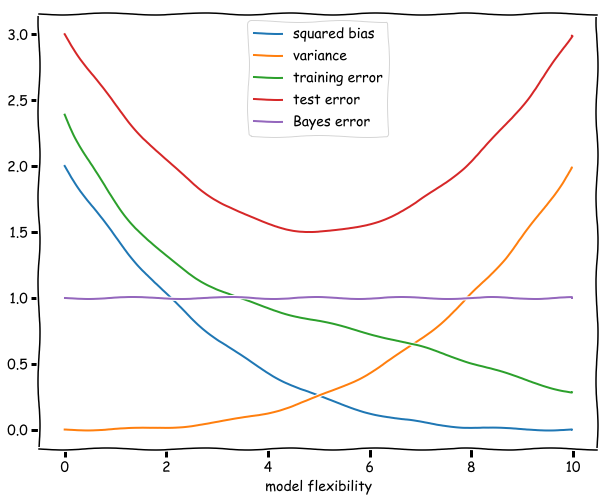

# Exercises - Chapter 2

## Exercise 1

For each of parts (a) through (d), indicate whether we would generally expect the performance of a flexible statistical learning method to be better or worse than an inflexible method. Justify your answer.

**General Thoughts**: Thinking about linear regression, we know that we can decompose the value of expected test MSE into 3 main parts: the main variance of the function used to model the phenomenon, the squared bias of the function, and the variance of $\epsilon$, which is the irreducible error. As from the book, in equation (2.7), we have:

$$E(y_{0}-\hat{f}(x_{0}))^2 = \mathrm{Var}(\hat{f}(x_{0})) + [\mathrm{Bias}(\hat{f}(x_{0}))]^2 + \mathrm{Var}(\epsilon)$$

Since $\mathrm{Var}(\epsilon)$ represents the lowest achievable error, a good test set performance requires both low variance from the prediction as well as a low squared bias. Supposing they were both zero, we would be only with:

$$E(y_{0}-\hat{f}(x_{0}))^2 = \mathrm{Var}(\epsilon)$$

When approximating a problem with a more simpler model (maybe a parametric model, inferring some linear relationship on our data), we introduce the **bias** error on the model. On the other hand, **variance** represents how much our estimation function would change if estimated on a different training set.

Generally, more flexible methods are know for having lower bias and higher variance.

(a) The sample size *n* is extremely large, and the number of predictors *p* is small.

**Answer**: We have lots of annotations and a small subset of possible predictors. We don't know if we're going to find easy relations between our predictors. Knowing that, maybe **using a more flexible approach** in this case would be better. Also, having more data helps the model not fit the noise inside of it, providing overall less variance, without providing much risk of *overfitting*.

(b) The number of predictors *p* is extremely large, and the number of observations *n* is small.

**Answer**: This may be the worst case when trying to create a model on some data. Here, we may have lots of noisy data and is hard to define which predictors are best to model our main variable. Due to this conditions, a **more flexible approach would be worse**. Highly flexible models would probably *overfit* the noise on the training set leading to poor predictions on our unseen data. For this case, a less flexible method may be a better decision, since it can help us reduce the risk of *overfitting* by adding some bias to the process.

(c) The relationship between the predictors and response is highly non-linear.

**Answer**: **A more flexible method would be my choice** here. Since those relationships are hard to understand and unclear by analyzing the data, choosing a less flexible method would not just introduce a higher bias on our analysis, but probably direct us to create an *underfitted* model, that wouldn't be capable of capturing the non-linear characteristics of the data.

(d) The variance of the error terms, i.e. $\sigma^{2} = Var(\epsilon)$ is extremely high.

**Awnser**: In this case, with a higher base variance, our models with higher flexibility would probably *overfit* our training data, so a **less flexible approach** would be my choice here.

## Exercise 2

Explain whether each scenario is a classification or regression problem, and indicate whether we are most interested in inference or prediction. Finally, provide n and p.

(a) We collect a set of data on the top 500 firms in the US. For each firm we record profit, number of employees, industry and the CEO salary. We are interested in understanding which factors affect CEO salary.

**Answer:** We want to predict the CEO Salary, so the CEO's salary is our target variable (or dependant variable). Knowing that the salary is a continuous value, we're looking at a regression problem. As the title says, we have 500 firms, so the number of records (n) is 500 and the predictors are: profit, number of employees, industry and the CEO salary. So, excluding the CEO's salary (what we want to predict), we have 3 predictors (p).

Regression problem. n = 500. p = 3.

(b) We are considering launching a new product and wish to know whether it will be a success or a failure. We collect data on 20 similar products that were previously launched. For each product we have recorded whether it was a success or failure, price charged for the product, marketing budget, competition price, and ten other variables.

**Answer:** We want to predict whether the product will be a success or failure. This categorizes the product into two possibilities, so, we're looking at a classification problem. We can see that we have 20 products, so our number of records (n) is 20. Also, for each product, we have the target itself (supervised problem), price charged, marketing budget, competition price and 10 other variables, so the number of predictors (p) is 13.

Classification problem. n = 20. p = 13.

(c) We are interested in predicting the % change in the USD/Euro exchange rate in relation to the weekly changes in the world stock markets. Hence we collect weekly data for all of 2012. For each week we record the % change in the USD/Euro, the % change in the US market, the % change in the British market, and the % change in the German market.

**Answer:** We want to predict the percent change (%), and that's a continuous value, so we're again, looking at a regression problem. The number of records is the number of weeks in a year for the year 2012, so our number (n) is 52. The number of predictors (p) is 3: the percent change in US, British and German markets.

Regression problem. n = 52. p = 3.

## Exercise 3

We now revisit the bias-variance decomposition.

(a) Provide a sketch of typical (squared) bias, variance, training error, test error, and Bayes (or irreducible) error curves, on a single plot, as we go from less flexible statistical learning methods towards more flexible approaches. The x-axis should represent the amount of flexibility in the method, and the y-axis should represent the values for each curve. There should be five curves. Make sure to label each one.

(b) Explain why each of the five curves has the shape displayed in part (a).

**Answer**: For each curve, in the order shown on the image:

- Squared bias: The Bias is the amount of error that the model introduces when making pre-assumptions on any data without clear relations (e.g. trying to fit a linear model where a curve would fit best, you create a linearity assumption that leads to bias). When enhancing the model flexibility (thus its complexity), we expose the data to models that can fit it better than a simpler model that makes an assumption on the data format, thus, reducing the squared bias when the complexity raises.

- Variance: The variance indicates how well the model fits the training portion of the data, and how this value changes when the model is submitted to a new portion of it. Lower flexibility models have a lower variance because they usually are parametric and create those assumptions on how the data is shaped that may or not be completely correct. When submitting a linear model to different sets of the data, the variance will be low in every set. When raising complexity, the model will fit best on each data that appears, but will need to change in every set that is presented.

- Extra: Low variance and high bias usually indicate *underfitted* models, whereas high variance and low bias usually indicate *overfitted* models.

- Test error: The test error starts high on low complexity and ends high in high complexity as well. This is due to the fact that simpler models may not be well trained to perform in unseen data, and higher complexity models are "too trained" in the training set that they can't generalize well in unseen points. The optimal point for the test error (the lowest) usually revolves around a model thats a little bit more flexible, but not too much.

- Training error: The training error starts high when low complexity and then goes on to a much smaller level in high complexity. This is due to the same concept applied on the "test error" part of this question. The only difference is that higher complexity usually learns only the patterns in the training, so the higher flexibility models usually can have very small training error (and lead to *overfitted* models).

- Bayes error: The Bayes error is also known as the irreducible error on the fitting process and don't change regardless of the model complexity. So, it is represented by a constant.

## Exercise 4

You will now think of some real-life applications for statistical learning.

(a) Describe three real-life applications in which classification might be useful. Describe the response, as well as the predictors. Is the goal of each application  inference or prediction? Explain your answer.

**Answer**: Three applications of *classification*:

1. Classifying if a medical patient has a disease or not. For this application, the response would be a binary response (0 for 'doesn't have the disease' or 1 for 'has the disease'), and the predictors could be some health measurements like blood pressure, % of body fat, and other medical parameters.
2. Classifying if an equipment is going to fail or not on the operation. For this application, the response would also be binary (0 for 'not fail' and 1 for 'failed'), and the predictors are the sensors that measure the equipment's condition.
3. Hand-digit recognition. For this application, we have a multi-label target (ranging from 0 to 9), and the predictors would be the features extracted from the pixels of the images representing the numbers 0 to 9.

(b) Describe three real-life applications in which regression might be useful. Describe the response, as well as the predictors. Is the goal of each application inference or prediction? Explain your answer.

**Answer**: Three applications of *regression*:

1. Housing prices. For this application, we want to predict the house price due to a number of factors on the house's characteristics: how many bedrooms, bathrooms, square footage of the house, etc.
2. Weather prediction. Here, similar to the housing prices case, we want as well to predict the weather for the next 7 days using characteristics of the weather. Here, we're also using a time-series analysis, considering seasonality and doing other transformations on our raw features, that may be like: weather on past days, % of rain, etc.
3. Credit score and risk assessment. Here, we want to predict a credit score for a new bank account/client. We can use past credit information to assess this new credit for the client. Possible predictors revolve around if the user pays correctly its bills, the monthly/yearly salary, and others.

(c) Describe three real-life applications in which cluster analysis might be useful.

**Answer**: Three applications of *clustering*:

1. Segment customer groups. Get the characteristics of each customer and segment them based on how their consuming patterns are.
2. Search engine results. Get the closest results based on segments of the input query.
3. Diagnosing cancer cells through image clustering. Use computer vision and image recognition to see if images of an tomography can display cancer or not.

## Exercise 5

What are the advantages and disadvantages of a very flexible (versus a less  flexible) approach for regression or classification? Under what circumstances might a more flexible approach be preferred to a less flexible approach? When might a less flexible approach be preferred?

**Answer**: For regression:

- More flexible method

    -

- Less flexible method

    -

For classification:

- More flexible method

    -

- Less flexible method

    -

## Exercise 6

Describe the differences between a parametric and a non-parametric
statistical learning approach. What are the advantages of a parametric
approach to regression or classification (as opposed to a nonparametric
approach)? What are its disadvantages?

**Answer**: For regression:

- Parametric

    -

- Non-parametric

    -

For classification:

- Parametric

    -

- Non-parametric

    -

## Exercise 7

The table below provides a training data set containing six observations,
three predictors, and one qualitative response variable.

|Obs.|$X_{1}$|$X_{2}$|$X_{3}$|$Y$|
|:-:|:-:|:-:|:-:|:-:|
|1|0|3|0|Red|
|2|2|0|0|Red|
|3|0|1|3|Red|
|4|0|1|2|Green|
|5|-1|0|1|Green|
|6|1|1|2|Red|

Suppose we wish to use this data set to make a prediction for Y when X1 = X2 = X3 = 0 using K-nearest neighbors.

(a) Compute the Euclidean distance between each observation and the test point, X1 = X2 = X3 = 0.

(b) What is our prediction with K = 1? Why?

(c) What is our prediction with K = 3? Why?

(d) If the Bayes decision boundary in this problem is highly nonlinear,
then would we expect the best value for K to be large or
small? Why?
